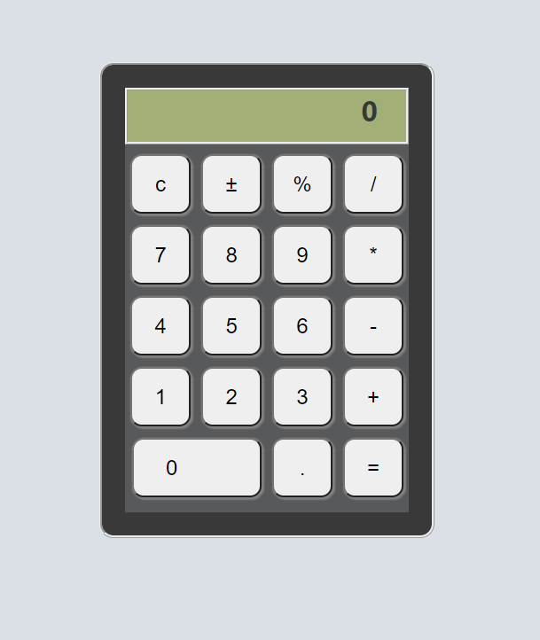

# React Hooks Calculator

To run this app first clone with:

>git clone https://github.com/sreader1414/calculator.git

Go to the directory on the command line and input:

>npm install

Once the install is done start the app with:

>npm start

Jest has been enabled for writing tests.  1 success and 1 fail test are included to show what the output would be like:
>npm test